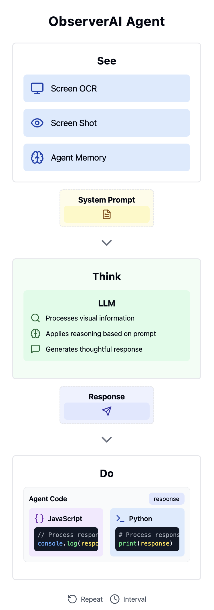

# Observer AI 👁️

An open-source platform for running local AI agents that enhance your computing experience while preserving privacy.

[](https://roy3838.github.io/observer-ai)
[](LICENSE)

<table>
  <tr>
    <td width="60%" valign="top">
      <h3>Key Features</h3>
      <ul>
        <li>🔒 <strong>Privacy First</strong>: All processing happens locally on your machine</li>
        <li>💻 <strong>Resource Efficient</strong>: Take advantage of unused consumer-grade hardware</li>
        <li>🔌 <strong>Extensible</strong>: Easy-to-use framework for creating and sharing custom agents</li>
        <li>🤝 <strong>Community Driven</strong>: Growing ecosystem of community-created agents</li>
        <li>🐍 <strong>Jupyter Server Support</strong>: Run Python agents with system-level access</li>
      </ul>
    </td>
    <td width="40%">
    
    </td>
  </tr>
</table>

## 🚀 Getting Started with Local Inference

We need to wrap Ollama to use https instead of http so that the browser can connect to it. This is done with self-signed SSL certificates.

```bash
# Make sure to have [Ollama](https://ollama.com) installed 

# For local inference run observer-ollama
pip install observer-ollama

# Click on the link provided so that your browser accepts self signed CERTS (signed by your computer)

#  OLLAMA-PROXY  ready
#  ➜  Local:   https://localhost:3838/
#  ➜  Network: https://10.0.0.138:3838/

# Click on proceed to localhost (unsafe), if "Ollama is running" shows up, you're done!

# Go to webapp:
app.observer-ai.com

# Enter your inference IP (localhost:3838) on the app header.
```

# 🏗️ Building Your Own Agent

Creating your own Observer AI agent is simple and accessible to both beginners and experienced developers.

## Quick Start

1. Navigate to the Agent Dashboard and click "Create New Agent"
2. Fill in the "Configuration" tab with basic details (name, description, model, loop interval)
3. Use the "Context" tab to visually build your agent's input sources by adding blocks:
   * **Screen OCR** block: Captures screen content as text via OCR
   * **Screenshot** block: Captures screen as an image for multimodal models
   * **Agent Memory** block: Accesses other agents' stored information

## Code Tab

The "Code" tab now offers a notebook-style coding experience where you can choose between JavaScript or Python execution:

### JavaScript (Browser-based)

JavaScript agents run in the browser sandbox, making them ideal for passive monitoring and notifications:

```javascript
// Remove Think tags for deepseek model
const cleanedResponse = response.replace(/<think>[\s\S]*?<\/think>/g, '').trim();

// Preserve previous memory
const prevMemory = await getMemory();

// Get time
const time = time();

// Update memory with timestamp
appendMemory(`[${time}] ${cleanedResponse}`);
```

Available utilities include:
* `time()` - Get the current timestamp
* `pushNotification(title, options)` - Send notifications
* `getMemory()` - Retrieve stored memory (defaults to current agent)
* `setMemory(content)` - Replace stored memory
* `appendMemory(content)` - Add to existing memory

### Python (Jupyter Server)

Python agents run on a Jupyter server with system-level access, enabling them to interact directly with your computer:

```python
#python <-- don't remove this!
print("Hello World!", response, agentId)

# Example: Analyze screen content and take action
if "SHUTOFF" in response:
    # System level commands can be executed here
    import os
    # os.system("command")  # Be careful with system commands!
```

The Python environment receives:
* `response` - The model's output
* `agentId` - The current agent's ID

## Example: Command Tracking Agent

A simple agent that responds to specific commands in the model's output:

```javascript
//Clean response
const cleanedResponse = response.replace(/<think>[\s\S]*?<\/think>/g, '').trim();

//Command Format
if (cleanedResponse.includes("COMMAND")) {
  const withoutcommand = cleanedResponse.replace(/COMMAND:/g, '');
  setMemory(`${await getMemory()} \n[${time()}] ${withoutcommand}`);
}
```

## Jupyter Server Configuration

To use Python agents:

1. Run a Jupyter server on your machine
2. Configure the connection in the Observer AI interface:
   * Host: The server address (e.g., 127.0.0.1)
   * Port: The server port (e.g., 8888)
   * Token: Your Jupyter server authentication token
3. Test the connection using the "Test Connection" button
4. Switch to the Python tab in the code editor to write Python-based agents

## Deploy & Share

Save your agent, test it from the dashboard, and export the configuration to share with others!

## 🤝 Contributing

We welcome contributions from the community! Here's how you can help:

1. Fork the repository
2. Create your feature branch (`git checkout -b feature/amazing-feature`)
3. Commit your changes (`git commit -m 'feat: add amazing feature'`)
4. Push to the branch (`git push origin feature/amazing-feature`)
5. Open a Pull Request

## 📄 License

This project is licensed under the MIT License - see the [LICENSE](LICENSE) file for details.

## 🔗 Links

- [Website](https://roy3838.github.io/observer-ai)
- [GitHub Repository](https://github.com/Roy3838/observer-ai)

## 📧 Contact

- GitHub: [@Roy3838](https://github.com/Roy3838)
- Project Link: [https://github.com/Roy3838/observer-ai](https://github.com/Roy3838/observer-ai)

---

Built with ❤️  by the Observer AI Community
